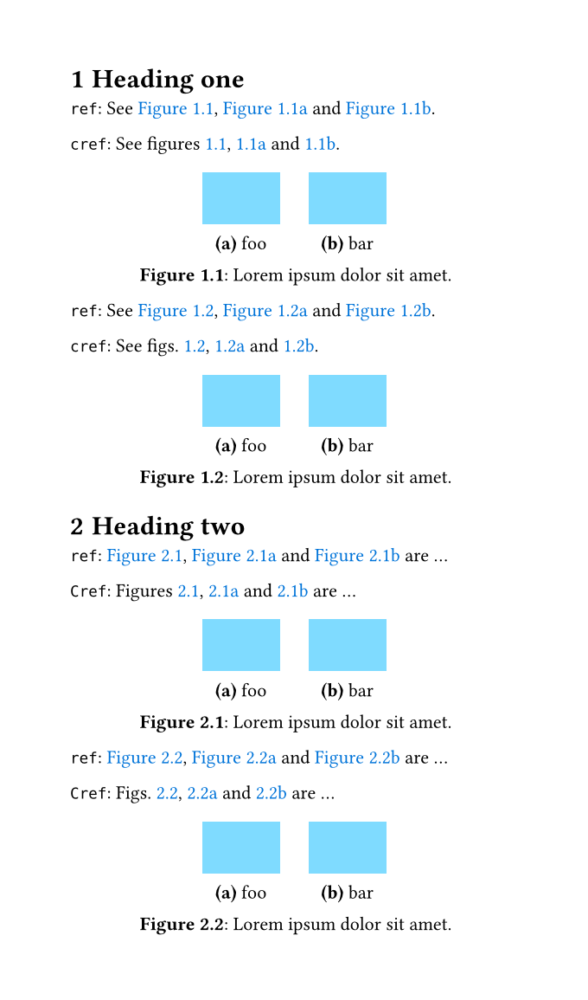

# Clever references for Typst

Smart handling of consecutive references (i.e. `cleveref` for Typst).

## Figures, tables and listings example

See [example/example-fig.typ](example/example-fig.typ).

## Subfigures example

See [example/example-subfig.typ](example/example-subfig.typ).

See [example/example-subfig-headings.typ](example/example-subfig-headings.typ).

